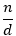
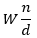

# Fractionability


**A lightweight JavaScript library for accessible fraction display**

**Fractionability** transforms decimals, strings, mixed numbers, percentages, and ratios into human-readable, screen-reader-friendly fractions. With built-in MathML generation, it ensures your web content is inclusive and accessible. Designed for simplicity and modularity, it’s ideal for developers building educational tools, recipe apps, financial calculators, and more.

---

## Why Fractionability?

Fractions like `1/2` or `3 1/2` are often displayed in ways that confuse screen readers, alienating visually impaired users. **Fractionability** addresses this by:

- Converting complex inputs into clear, simplified fractions.
- Generating MathML for enhanced accessibility.
- Offering a chainable, intuitive API.
- Supporting real-world use cases like recipes, finance, and education.

> **Note:** This is *not* an equation editor. For advanced mathematical notation, pair it with MathML or specialized libraries.

---

## Features

- ✅ Convert decimals to fractions (e.g., `0.75` → `3/4`).  
- ✅ Parse fraction strings (e.g., `'3/4'` → fraction object).  
- ✅ Handle mixed numbers (e.g., `'3 1/2'` → `7/2`).  
- ✅ Support percentages (e.g., `'50%'` → `1/2`).  
- ✅ Interpret ratios (e.g., `'2:3'` → `2/3`).  
- ✅ **Simplify fractions automatically** (e.g., `'4/8'` → `1/2`).  
- ✅ Perform arithmetic (add, subtract, multiply, divide).  
- ✅ Compare fractions (equality checks, proper fraction detection).  
- ✅ Convert fractions (to decimal, mixed number, or string).  
- ✅ Generate MathML for **accessible display**.  
- ✅ Chain methods (e.g., `fraction('7/3').add('1/2').toMathML()`).  
- ✅ **Provide standalone functions** (e.g., `evaluate('3 * 1/6')`).  
- ✅ Focus on fraction display, not complex equations.

---

## Installation

### Via npm
```bash
npm install fractionability
```

### Via Yarn
```bash
yarn add fractionability
```

### Via Alias (Shorthand)
```bash
npm install f13y@npm:fractionability
```

### Manual Setup
```bash
git clone https://github.com/waiz3ple/fractionability.git
cd fractionability
npm install
npm run build
```

### Testing
Run unit tests:
```bash
npm run test
```

### Building
Build the project:
```bash
npm run build
```

---

## Usage

### For ES Modules (ESM)
```javascript
import { fraction, add, toMathML } from 'fractionability';
// Or with alias
import { fraction, add, toMathML } from 'f13y';
```

### For CommonJS (CJS)
```javascript
const { fraction, add, toMathML } = require('fractionability');
// Or with alias
const { fraction, add, toMathML } = require('f13y');
```

> **Tip:** Both ESM (`import`) and CJS (`require`) are supported. Use the syntax that matches your project!

---

## Examples

### 1. Creating Fractions
```javascript
const { fraction } = require('fractionability');

// From decimal
console.log(fraction(0.75).toString()); // '3/4'

// From string
console.log(fraction('2/3').toString()); // '2/3'

// From mixed number
console.log(fraction('1 2/3').toString()); // '5/3'

// From percentage
console.log(fraction('50%').toString()); // '1/2'

// From ratio
console.log(fraction('2:3').toString()); // '2/3'
```

### 2. Simplification
```javascript
const { fraction } = require('fractionability');
const frac = fraction('4/8');
console.log(frac.toString()); // '1/2' (auto-simplified)
```

### 3. Arithmetic
```javascript
const { add, subtract, multiply, divide } = require('fractionability');

console.log(add('2/3', '3/7').toString());      // '23/21'
console.log(subtract('5/6', '1/3').toString()); // '1/2'
console.log(multiply('2/3', '3/4').toString()); // '1/2'
console.log(divide('2/3', '3/4').toString());   // '8/9'
```

### 4. Comparisons
```javascript
const { isEqual, isProper } = require('fractionability');

console.log(isEqual('2/4', '1/2')); // true
console.log(isProper('5/3'));       // false
```

### 5. Conversions
```javascript
const { fraction } = require('fractionability');
const frac = fraction('7/3');

console.log(frac.toDecimal());     // 2.333...
console.log(frac.toMixedNumber()); // '2 1/3'
console.log(frac.toString());      // '7/3'
```

### 6. MathML Output
```javascript
const { fraction } = require('fractionability');

console.log(fraction('3/4').toMathML());
// <math aria-label="3 over 4">
//   <mfrac>
//     <mn>3</mn>
//     <mn>4</mn>
//   </mfrac>
// </math>

console.log(fraction('7/3').toMathML());
// <math aria-label="2 and 1 over 3">
//   <mn>2</mn>
//   <mfrac>
//     <mn>1</mn>
//     <mn>3</mn>
//   </mfrac>
// </math>
```
> **Note:** Improper fractions are automatically converted to mixed numbers in MathML.

### 7. Expression Evaluation
```javascript
const { evaluate } = require('fractionability');
console.log(evaluate('3 * 1/6').toString()); // '1/2'
```

### 8. Chaining
```javascript
const { fraction } = require('fractionability');
const result = fraction('7/3').add('1/2').toMixedNumber();
console.log(result); // '2 5/6'
```

---

## Real-World Use Cases

### Recipes
Scale ingredients effortlessly:
```javascript
const { fraction, multiply } = require('fractionability');
const sugar = fraction('1/2');
const doubled = multiply(sugar, 2);
console.log(doubled.toString()); // '1'
```

### Finance
Split bills by ratio:
```javascript
const { fraction, multiply, subtract } = require('fractionability');
const total = 100;
const ratio = fraction('2:3');
const part1 = multiply(total, ratio);
const part2 = subtract(total, part1);
console.log(part1.toString(), part2.toString()); // '40', '60'
```

### Education
Visualize fractions with MathML:
```javascript
const { fraction } = require('fractionability');
const mathML = fraction('3/4').toMathML();
console.log(mathML); // MathML for '3/4'
```

### Construction
Sum measurements:
```javascript
const { fraction, add } = require('fractionability');
const total = add('3 1/2', '2 3/4');
console.log(total.toMixedNumber()); // '6 1/4'
```

---

## React Integration

### Recipe App
```javascript
import React from 'react';
import { fraction } from 'fractionability';

const Recipe = () => {
  const sugar = fraction('1/2').multiply(2);
  return <p>Doubled Sugar: {sugar.toString()}</p>; // '1'
};
```

### Finance App
```javascript
import React from 'react';
const { fraction, multiply } = require('fractionability');

const Finance = () => {
  const interest = multiply(1000, fraction('5%'));
  return <p>Interest: ${interest.toString()}</p>; // '$50'
};
```

---

## Accessibility Matters

Linear fraction formats (e.g., `3 1/2`) confuse screen readers. **Fractionability** ensures clarity with proper fraction objects and MathML, making your content inclusive for all users.

 

---

## Contributing

1. Fork the repo: [github.com/waiz3ple/fractionability](https://github.com/waiz3ple/fractionability)
2. Create a branch: `git checkout -b feature/your-feature`
3. Commit changes: `git commit -m "Add your feature"`
4. Push and open a pull request.

---

## License

Licensed under the [MIT License](./LICENSE).

---

## Support

File issues or ask questions on [GitHub Issues](https://github.com/waiz3ple/fractionability/issues).

---

## Disclaimer

**Fractionability** focuses on accessible fraction display, not complex equation editing. For advanced mathematics, explore MathML or other tools.

---

**Make the web inclusive with Fractionability!**